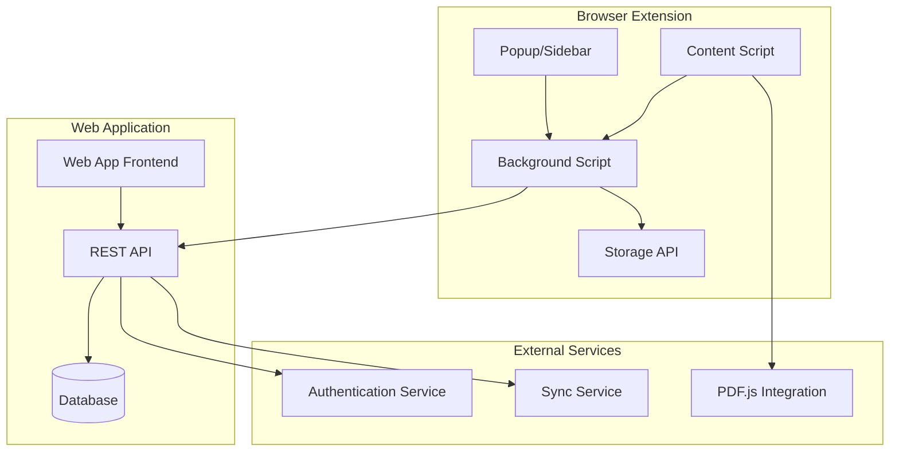

# Design Document

## Overview

The browser highlighting plugin is designed as a cross-platform browser extension with a companion web application. The system uses a content script architecture to inject highlighting functionality into web pages and PDFs, with a robust synchronization system to maintain user data across devices. The design emphasizes performance, privacy, and user experience while providing comprehensive annotation capabilities.

## Architecture

### High-Level Architecture



### Component Interaction Flow

1. **Content Script** injects into web pages and handles text selection/highlighting
2. **Background Script** manages data persistence, API communication, and cross-tab coordination
3. **Popup/Sidebar** provides quick access to highlights and notes for current page
4. **Web Application** offers comprehensive management interface
5. **Sync Service** ensures data consistency across devices

## Components and Interfaces

### Content Script Component

**Purpose:** Handles text selection, highlight rendering, and user interactions on web pages and PDFs.

**Key Interfaces:**
- `HighlightManager`: Creates, renders, and manages highlights on the page
- `TextSelector`: Handles text selection and range management
- `PDFHandler`: Specialized handling for PDF documents
- `UIController`: Manages highlight tooltips and interaction menus

**Implementation Details:**
- Uses Range API for precise text selection
- Implements text anchoring for highlight persistence across page changes
- Integrates with PDF.js for PDF highlighting support
- Provides visual feedback for highlight interactions

### Background Script Component

**Purpose:** Central coordination hub for data management, API communication, and extension lifecycle.

**Key Interfaces:**
- `DataManager`: Handles local storage and data synchronization
- `APIClient`: Manages communication with web application backend
- `MessageRouter`: Coordinates communication between extension components
- `SyncController`: Handles offline/online data synchronization

**Implementation Details:**
- Uses Chrome Extension Storage API for local persistence
- Implements retry logic for failed API calls
- Manages authentication tokens and session state
- Coordinates data updates across multiple tabs

### Web Application Component

**Purpose:** Comprehensive interface for managing highlights, notes, and user preferences.

**Key Interfaces:**
- `HighlightViewer`: Displays and organizes user highlights
- `SearchEngine`: Provides full-text search across highlights and notes
- `ExportManager`: Handles data export in various formats
- `UserSettings`: Manages user preferences and configuration

**Implementation Details:**
- React-based single-page application
- Implements virtual scrolling for large highlight collections
- Provides advanced filtering and sorting capabilities
- Supports bulk operations on highlights and notes

### Data Storage Component

**Purpose:** Manages data persistence, synchronization, and backup across local and cloud storage.

**Key Interfaces:**
- `LocalStorage`: Browser extension storage management
- `CloudStorage`: Remote data persistence and synchronization
- `ConflictResolver`: Handles data conflicts during synchronization
- `BackupManager`: Manages data backup and recovery

## Data Models

### Highlight Model

```typescript
interface Highlight {
  id: string;
  url: string;
  title: string;
  selectedText: string;
  color: HighlightColor;
  position: TextPosition;
  createdAt: Date;
  updatedAt: Date;
  notes: Note[];
  tags: string[];
  userId: string;
}

interface TextPosition {
  startContainer: string;
  startOffset: number;
  endContainer: string;
  endOffset: number;
  anchorText: string;
  contextBefore: string;
  contextAfter: string;
}
```

### Note Model

```typescript
interface Note {
  id: string;
  highlightId: string;
  content: string;
  createdAt: Date;
  updatedAt: Date;
  editHistory: NoteEdit[];
}

interface NoteEdit {
  timestamp: Date;
  previousContent: string;
  newContent: string;
}
```

### User Preferences Model

```typescript
interface UserPreferences {
  defaultHighlightColor: HighlightColor;
  autoSyncEnabled: boolean;
  showHighlightTooltips: boolean;
  exportFormat: ExportFormat;
  privacySettings: PrivacySettings;
}
```

## Error Handling

### Client-Side Error Handling

1. **Content Script Errors:**
   - Graceful degradation when DOM manipulation fails
   - Fallback text selection methods for complex page layouts
   - Error reporting without breaking host page functionality

2. **Storage Errors:**
   - Automatic retry with exponential backoff
   - Local fallback when cloud sync fails
   - User notification for persistent storage issues

3. **Network Errors:**
   - Offline mode with local data queuing
   - Automatic sync when connection restored
   - Clear user feedback about sync status

### Server-Side Error Handling

1. **API Errors:**
   - Structured error responses with actionable messages
   - Rate limiting with clear retry instructions
   - Graceful handling of authentication failures

2. **Data Integrity:**
   - Validation at API boundaries
   - Conflict resolution for concurrent edits
   - Backup and recovery procedures

## Testing Strategy

### Unit Testing

- **Content Script Testing:** Mock DOM environments for highlight creation and rendering
- **Background Script Testing:** Test data synchronization and API communication logic
- **Web App Testing:** Component testing with React Testing Library
- **Data Model Testing:** Validation and serialization testing

### Integration Testing

- **Cross-Component Communication:** Test message passing between extension components
- **API Integration:** Test full data flow from extension to web application
- **Browser Compatibility:** Automated testing across Chrome, Firefox, Safari, and Edge
- **PDF Integration:** Test highlighting functionality with various PDF formats

### End-to-End Testing

- **User Workflows:** Complete highlighting and note-taking scenarios
- **Synchronization Testing:** Multi-device data consistency verification
- **Performance Testing:** Load testing with large highlight collections
- **Security Testing:** Authentication and data privacy validation

### Performance Testing

- **Page Load Impact:** Measure extension impact on page loading times
- **Memory Usage:** Monitor memory consumption during extended use
- **Highlight Rendering:** Test performance with large numbers of highlights
- **Sync Performance:** Measure synchronization speed with various data volumes

## Security Considerations

### Data Protection

- **Encryption:** AES-256 encryption for sensitive data at rest and in transit
- **Authentication:** OAuth 2.0 with JWT tokens for secure API access
- **Privacy:** Minimal data collection with user consent for analytics
- **Compliance:** GDPR and CCPA compliance with data deletion capabilities

### Extension Security

- **Content Security Policy:** Strict CSP to prevent XSS attacks
- **Permission Management:** Minimal required permissions with clear justification
- **Code Injection Prevention:** Sanitization of all user-generated content
- **Secure Communication:** HTTPS-only communication with backend services